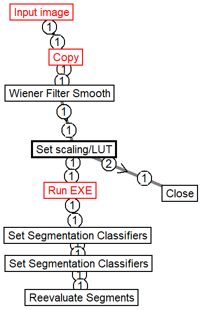

# Cellpose segmentation
## Parameters:
|Name|#|Type|Description|
|Cells: Scale maximum (percentile)|1|real|This percentile of the image histogram sets the intensity value where the maximum of the Look Up Table (LUT) is scaled. Use -1 to override this with fixed value set below at "Max value".|
|Cells: Smooth factor|2|real|Wiener filter noise level (0-1). Higher value provides more smoothing.|
|Cells: Gamma|3|real|A gamma value >1 makes image supralinearly brighter, a gamma value <1 makes the image sublinearly darker.|
|Cells: Cellpose Model (pretrained network)|4|string|Enter a pretrained model name from the model zoo, or name for user trained model installed into the GUI. See --pretrained_model option in Cellpose.|
|Cells: Cellpose Diamenter (pixels)|5|string|Approximate diameter of objects in pixels|
|Cells: Cellpose --flow_threshold|6|string|Maximum allowed error of the flows for each mask.|
|Cells: Cellpose --cellprob_threshold|7|string|Minimum probability to return ROIs|
|Cells: Minimum size of cells (pixels area)|8|integer|The result provided by Cellpose is gated for this minimum pixel area per nucleus|
|Cells: Maximum size of cells (pixels area)|9|integer|Volume in 3D, area in 2D. 0 for not checking|
|Python.exe in the Cellpose Environment|10|string|Prerequisite:Cellpose. Change environment name if needed. Syntax: Filename with full path, or filename only if it is in the environment path. Alternatively, use one or more command prompt expressions with arguments concatenated by && and the whole expression quoted with ".|
|Cellpose: number of parallel processes|11|integer|Image series and time courses will be split into multiple parts and separate instances of the external program is launched.|
|Cellpose: --batch_size|12|string|Set batch size according to the GPU memory|
## Description:
This snippet uses Cellpose to detect nuclei or cells in a single channel. The input image (series) is exported, processed by Cellpose 2.0 command line and results are imported. Image transfer is through a unique temp folder opened for each call, within the Image Export Folder. See Files/Set Folder Locations to set this. By default, these temporary folders are deleted, see switch in the Run EXE function. Use Cellpose GUI to fine tune thresholds. Start GUI in Pipelines/Using External Programs/Cellpose/Launch cellpose GUI. Save images to be loaded into the GUI use the Files/Export RGB Full Size Image, or by disabling temp folder deletion above, and locating the temp folder.

Cellpose will run faster if the same number of images are processed as an image series than one-by-one. Further speed increment can be achieved by increasing batch size and number of parallel processes, depending on the available system memory and the image size. Use batch size of 64 and 4 parallel processes with 24GB GPU. Further command line options can be entered by editing this pipeline in the Run EXE function, Argument parameter.

This pipeline uses Cellpose 2.0. Cellpose is installed by the user as given in the Image Analyst MKII Primer/TOC/Using external programs.

Pachitariu M, Stringer C. Cellpose 2.0: how to train your own model. Nat Methods. 2022;19(12):1634-41
https://github.com/MouseLand/cellpose

Keywords: U-Net, CNN, deep learning, generalist cell segmentation, artificial intelligence, AI

